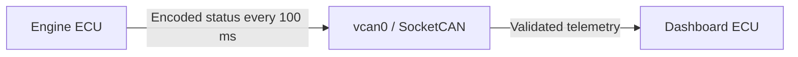

# Embedded CAN Bus ECU Simulator

An automotive ECU simulation built with C++17. The current desktop prototype
uses two Linux processes to exchange engine telemetry over SocketCAN: the engine
publishes every 100 ms, and the dashboard validates and prints each message.
The protocol library and its tests also build on Windows.



The project is being developed toward STM32 and Zephyr support. This version
implements desktop communication only; hardware firmware, diagnostics, and fault
monitoring are future work. Its throttle sweep generates repeatable traffic;
it is not a physical engine model.

## Build and test

Requirements: CMake 3.20+, a C++17 compiler, and a build tool such as Make or Ninja.
The two applications require Linux with SocketCAN headers. Tests have no external
framework dependency and do not need CAN hardware, root access, or network access.

On Debian/Ubuntu, install the tools if needed:

```bash
sudo apt update
sudo apt install build-essential cmake iproute2 can-utils
```

Clone the repository, then configure, build, and test:

```bash
git clone https://github.com/mBian2/can-ecu-simulator.git
cd can-ecu-simulator
cmake -S . -B build -DCMAKE_BUILD_TYPE=Debug
cmake --build build --parallel
ctest --test-dir build --output-on-failure
```

On Windows, use a Visual Studio Developer PowerShell or Developer Command Prompt:

```powershell
cmake -S . -B build
cmake --build build --config Debug
ctest --test-dir build -C Debug --output-on-failure
```

Windows builds only the portable library and protocol tests. Running the two
applications requires a Linux host or a WSL installation whose kernel supports
CAN and vcan. Windows test results do not validate Linux socket behavior.

## Set up a virtual CAN interface

Run these commands on Linux. They change network configuration and require sudo:

```bash
sudo modprobe vcan
sudo ip link add dev vcan0 type vcan
sudo ip link set dev vcan0 up
ip -details link show vcan0
```

If vcan0 already exists, skip the `ip link add` command. If `modprobe` reports a
missing module, the running kernel may lack vcan support; a kernel with built-in
vcan support can still accept `ip link add`. Virtual CAN needs no bitrate setting
and does not reproduce physical CAN arbitration, bus timing, or electrical faults.

Run the dashboard in one terminal:

```bash
./build/dashboard_ecu
```

Run the engine in a second terminal:

```bash
./build/engine_ecu
```

Both accept a single interface argument, for example `./build/engine_ecu vcan0`.
Use `--help` for usage. Stop each process with Ctrl+C. The engine waits on a
monotonic clock; the dashboard waits in `poll()` with a 100 ms timeout. Neither
process launches extra worker threads. The signal handler only sets a stop flag.
Shutdown normally occurs within the next 100 ms wait, subject to OS scheduling
and output blocking.

Example dashboard output near the start of an engine run:

```text
Dashboard listening on vcan0. Ctrl+C to stop.
RPM: 800 | Coolant: 80 C | Throttle: 0%
RPM: 845 | Coolant: 80 C | Throttle: 1%
RPM: 890 | Coolant: 80 C | Throttle: 2%
```

The first observed sample depends on when each process starts. Throttle rises
from 0% to 100% and falls back over 20 seconds; RPM and temperature follow it.
Missed transmission slots are skipped rather than sent in a catch-up burst.

## Manual Linux checks

With the dashboard running, use `can-utils` to inject known frames:

```bash
cansend vcan0 100#09C4005B23
cansend vcan0 100#0000FFD800
cansend vcan0 100#2EE000D764
cansend vcan0 100#09C4005B
cansend vcan0 100#09C4005B65
cansend vcan0 101#09C4005B23
cansend vcan0 00000100#09C4005B23
cansend vcan0 100#R
```

The first three frames should print `(2500, 91, 35)`, `(0, -40, 0)`, and
`(12000, 215, 100)` as RPM, Celsius, and percent. The remaining frames should
produce an `Ignored frame` warning for wrong length, invalid throttle, wrong ID,
extended format, and remote request respectively. The dashboard should continue
accepting valid frames afterward. CAN FD reception is disabled at the socket.

Additional checks:

- Start the dashboard alone: it should wait quietly and exit on Ctrl+C.
- Run `./build/engine_ecu missing_can`: it should report a missing interface and
  exit unsuccessfully. The dashboard should behave similarly.
- Run `candump -tz vcan0` while the engine runs to inspect payloads and approximate
  100 ms transmission intervals. This is a scheduling check, not a real-time guarantee.
- Stop both applications before removing a virtual interface you created:
  `sudo ip link delete vcan0`.

The driver reports socket failures separately from timeouts. Startup and runtime
socket failures end the process with an error; malformed application messages
are logged and skipped. A saturated transmit queue is reported as a send error.

## Design

- `common/can`: fixed-capacity frame, protocol codec, and small driver interface.
- `platform/linux`: noncopyable socket owner; opens/binds once and closes on exit.
- `engine_ecu`: deterministic telemetry and periodic transmission.
- `dashboard_ecu`: receive loop, validation, and text output.
- `tests`: protocol unit tests and a Linux SocketCAN integration test.

Frames and codec results use fixed-size storage. No payload allocation occurs in
the codec or driver processing path. Startup strings, error formatting, and C++
stream internals can allocate; this milestone makes no hard real-time claim.
The driver interface is single-owner and does not promise concurrent access.

See [the wire protocol](docs/can_protocol.md) and the
[Linux SocketCAN documentation](https://docs.kernel.org/networking/can.html).
See [testing](docs/testing.md) for automated checks and their scope.

## License

[MIT](LICENSE).
