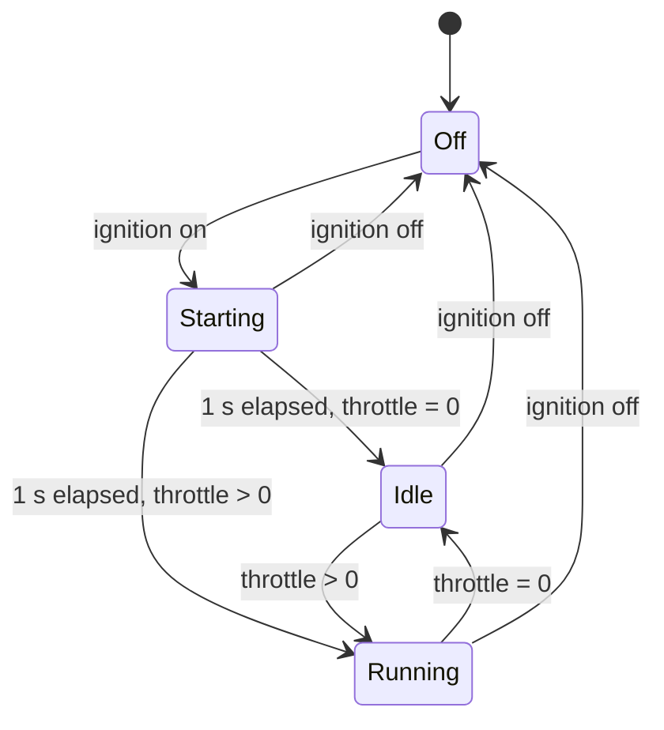

# Engine controller

`EngineController` is a deterministic C++17 model. It stores operating state,
startup progress, RPM, temperature, and applied throttle. The caller supplies an
`EngineInputs` value and a `std::chrono::milliseconds` interval to `update()`.
It has no clock, sleeps, logging, socket access, or dynamic allocation.

## Update contract

Inputs are held constant for the supplied interval. Valid throttle requests are
integers from 0 to 100 inclusive, even when ignition is off. Elapsed time must
be between 0 and 1,000 ms inclusive. Invalid throttle is checked first, followed
by elapsed time; errors leave every field unchanged. There is no clamping or
partial application of invalid updates.

A valid zero-duration update is a no-op, including its ignition and throttle
inputs. A positive-duration update applies inputs from the start of the interval.
Intervals above one second are rejected to make unexpected scheduling gaps
explicit. Offline callers can advance longer periods with successive valid updates.

## Transitions

| Current state | Input or condition | Result |
| --- | --- | --- |
| Any | Valid zero-duration update | Unchanged |
| Any | Invalid update | Error; unchanged |
| Any active state | Ignition off | Off; zero RPM/throttle; startup progress cleared |
| Off | Ignition remains off | Remain off; cool toward ambient |
| Off | Ignition on | Start a fresh one-second startup |
| Starting | Less than one second accumulated | Remain starting; throttle ignored |
| Starting | One second accumulated, throttle zero | Idle |
| Starting | One second accumulated, throttle positive | Running |
| Idle or Running | Ignition on, throttle zero | Idle; approach idle RPM |
| Idle or Running | Ignition on, throttle positive | Running; approach demanded RPM |

When an update crosses the startup boundary, its time is split: the starting
portion ramps toward idle and only the remaining portion accelerates under the
current throttle input. A throttle request during startup is not latched; the
input supplied on the completing update determines the next state.

Idle and Running describe the requested operating mode. After throttle release,
the state becomes Idle immediately while RPM takes time to settle. Ignition-off
stops RPM immediately as a deliberate simplification; the acceleration and
deceleration rate limits apply while operating, not to this stop transition.
Coolant does not reset when ignition switches off.

## Parameters and numerical behavior

All parameters are named in `EngineParameters` and use seconds, RPM, or Celsius.

| Parameter | Value |
| --- | --- |
| Startup duration | 1 s |
| Idle / maximum RPM | 800 / 5,300 |
| Starting ramp | 800 RPM/s |
| Operating acceleration / deceleration | 1,500 / 2,000 RPM/s |
| Ambient temperature | 20 C |
| Idle / full-throttle temperature target | 80 / 100 C |
| Warming / cooling rate | 2 / 1 C/s |

With throttle fraction `d` in [0, 1], operating targets are `800 + 4500*d` RPM
and `80 + 20*d` C. Starting targets idle speed/temperature; Off targets ambient
temperature. Each variable approaches its target at the applicable bounded rate
without overshooting. These are simple rate-limited targets, not thermal or
combustion equations.

RPM and temperature use `double` internally, so millisecond updates preserve
fractional progress. `telemetry()` rounds to the nearest integer (halfway away
from zero). It returns the existing `EngineStatus`; CAN ID 0x100, its five-byte
layout, units, and validation ranges are unchanged. Throttle telemetry is zero
while Off/Starting and reflects the applied request when Idle/Running. State is
logged by the application and is not sent in extra payload bytes.

## Application timing and demo

`DemoScenario.hpp` supplies a repeating 12-second sequence of ignition/throttle
inputs, independently of the controller. See the README for its timeline. The
input sequence repeats, but coolant retains its history across cycles.

The Linux executable uses `steady_clock` and advances the model in 20 ms steps.
Each step samples demo inputs at the beginning of its simulated interval. The
12-second scenario boundaries align with those steps. Transitions are logged
after the step that produces them, so a log may appear up to one step after an
input boundary, plus OS scheduling delay.

On each wake, the executable catches up completed model steps before sending
the latest status if its 100 ms transmit deadline has arrived. It sends at most
one frame per wake and advances to the next future deadline. Catch-up is limited
to one second (50 model steps); a longer lag terminates with a clear error.
This bounds work and avoids silently skipping controller transitions. There is
no hard real-time guarantee and no additional worker thread.

The dashboard and SocketCAN driver retain their existing responsibilities. The
portable controller can be tested on Windows or Linux before any MCU port exists.
